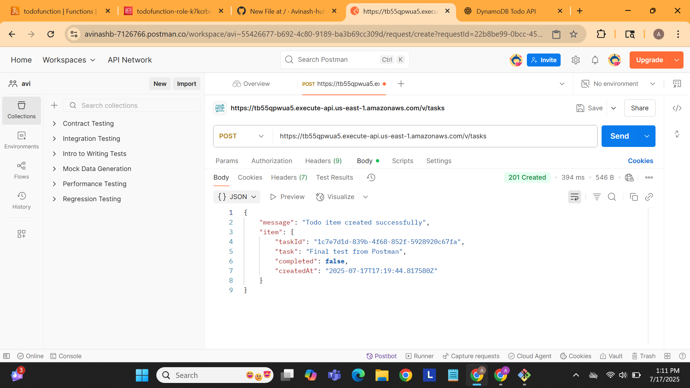

# 📝 Serverless To-Do List API

This is a serverless backend built using **AWS Lambda**, **API Gateway**, and **DynamoDB** to manage a simple to-do list. It provides an HTTP API to create todo items using a `POST` request.

---

## 🚀 Architecture

- **API Gateway**: Receives HTTP requests
- **AWS Lambda**: Handles business logic (Python)
- **DynamoDB**: Stores todo items with unique `taskId`s

---

## 🧱 Tech Stack

- AWS Lambda (Python 3.x)
- Amazon DynamoDB
- Amazon API Gateway (REST API with proxy integration)
- curl/Postman for testing

---

## 🧪 Features

- `POST /tasks`: Creates a new todo item  
  **Request Body:**
  ```json
  {
    "task": "Buy groceries",
    "completed": false
  }



